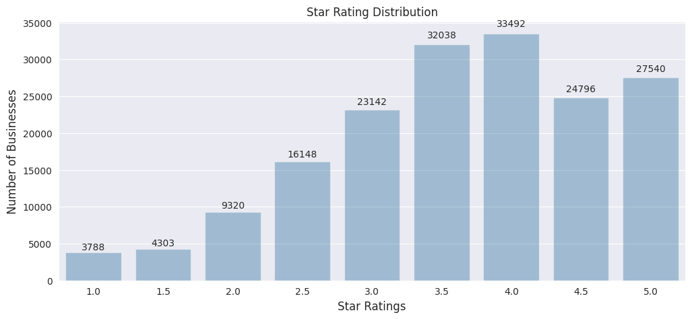
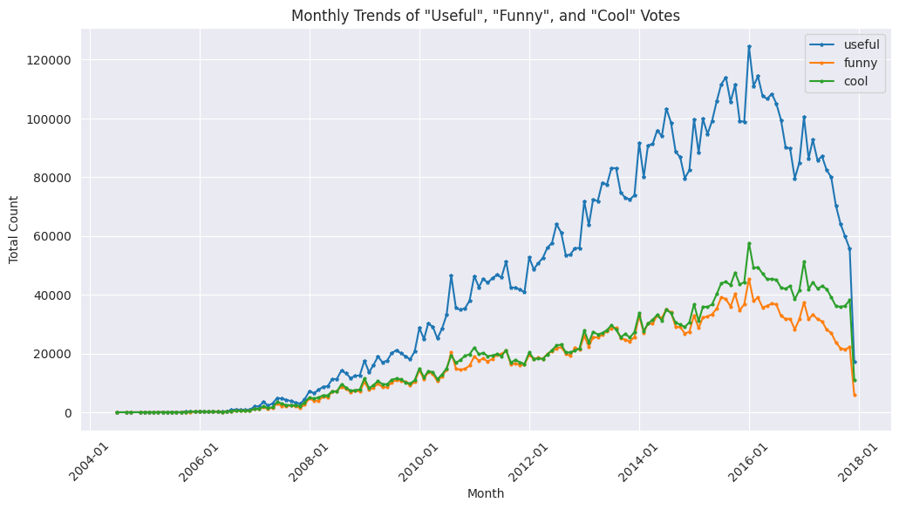
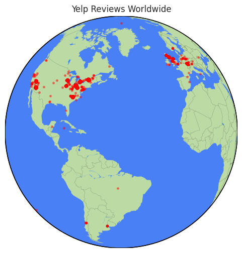
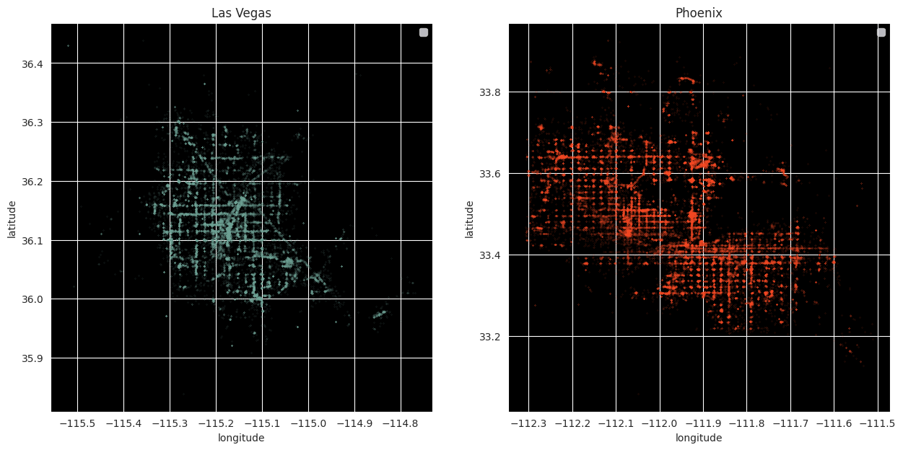
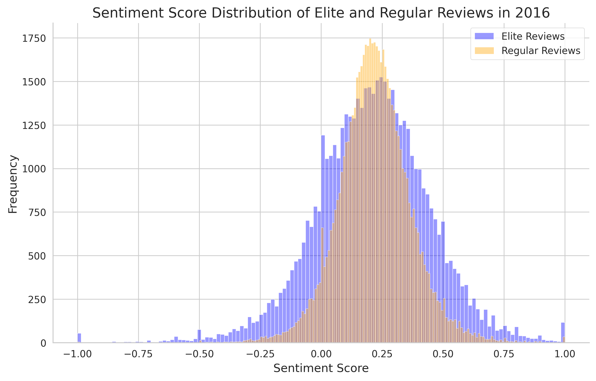
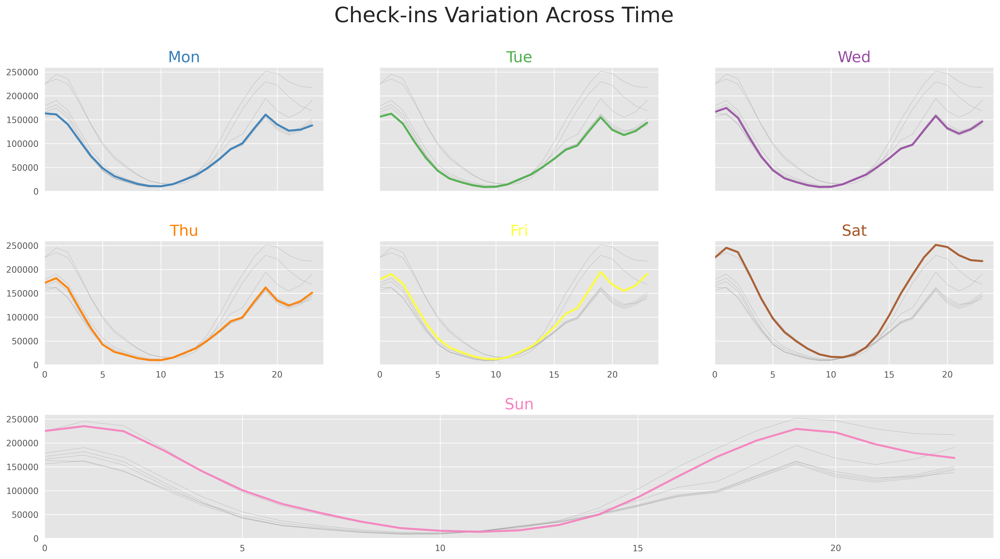
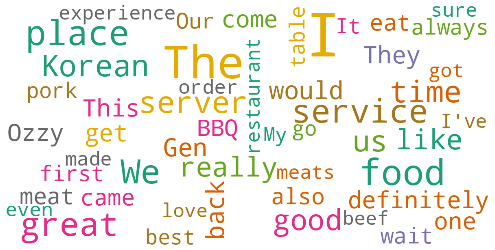

# Yelp Dataset Analysis & Visualization


## 💻 Technology Stack

- **Python**: Core programming language
- **Pandas & NumPy**: Data manipulation
- **Matplotlib & Seaborn**: Static visualizations
- **Folium**: Interactive maps
- **NLTK & TextBlob**: Text processing and sentiment analysis
- **WordCloud**: Text visualization

## 📊 Overview

Yelp is a company that provides crowdsourced reviews and online reservation services for local businesses. It was founded in 2004 by former PayPal employees. Yelp allows users to rate and review various types of local businesses on its platform, including restaurants, cafes, hotels, shops, and more. Users can use Yelp to explore others’ opinions and reviews, helping them make more informed consumption decisions.

The Yelp review dataset is a rich collection of review information gathered from the Yelp platform, including ratings, review texts, user information, and business information. By analyzing this data, we can gain insights into user opinions on various business types, uncover valuable patterns such as user preferences and business strengths or weaknesses, and provide targeted advice and recommendations to local businesses and users.

This project aims to analyze the Yelp review dataset to explore trends, patterns, and associations within the data, extracting valuable insights through visualizations, statistical analysis, and network analysis. Through this data analysis, we can gain a deeper understanding of user behavior, business conditions, and social networks within the Yelp review ecosystem, ultimately helping Yelp and its users make better decisions and offer improved services.

## 📊 Data Summary and Application Value

Through comprehensive analysis of the Yelp dataset, we've uncovered several valuable insights that have both academic significance and practical applications:

### Key Findings Summary

1. **Positive Rating Bias**: Most businesses (over 60%) receive 3.5 stars or higher, indicating users tend to share positive experiences
2. **Review Length-Sentiment Relationship**: Negative reviews (1-2 stars) average about 30% longer than positive ones, showing users have stronger expressive desire for negative experiences
3. **Power Law User Distribution**: A small minority of active users (about 1%) contribute approximately 20% of review content, showing platform dependency on core users
4. **Geographic Distribution Reflects Urban Planning**: U.S. cities show grid-like business distributions while European cities display organic, radial patterns
5. **Check-in Patterns Show Clear Temporal Rhythms**: Weekend activity increases by 30%, with daily peaks between 5-7 PM

### Business Application Value

#### Value for Businesses

1. **Reputation Management Strategies**:
   - Understanding the positive bias in ratings means even a few negative reviews can significantly impact overall perception
   - Prioritizing responses to negative reviews may yield greater reputation improvement
   - Focus should be on negative reviews with high "useful" votes, as these have the greatest influence on potential customers

2. **Operational Optimization**:
   - Adjust staffing based on check-in patterns, increasing service personnel during peak hours (5-7 PM and weekends)
   - Leverage off-peak hours for special promotions to balance customer flow
   - Benchmark against industry-leading businesses' keywords (e.g., "service," "value," "experience") to improve operational focus

3. **Location Strategy**:
   - Select store locations based on city-specific business distribution patterns
   - Consider intersection locations in U.S. cities to maximize visibility
   - In European cities, focus on historical pathways and landmark proximity

#### Value for the Yelp Platform

1. **User Engagement Optimization**:
   - Design strategies to increase one-time users' continued engagement, such as simplified review processes or small rewards
   - Develop features to balance the length deficit in positive reviews, such as positive review templates or guiding questions
   - Nurture high-quality content creators to maintain the core user base

2. **Platform Feature Development**:
   - Develop intelligent recommendation systems based on check-in pattern data to recommend relevant businesses at specific times
   - Improve search algorithms using sentiment analysis to enhance result relevance
   - Develop location-based features tailored to different city layouts

3. **Data Product Opportunities**:
   - Provide competitive analysis tools for businesses based on review text and sentiment analysis
   - Develop consumer behavior prediction models to help businesses optimize marketing strategies
   - Create location optimization tools based on city-specific business distribution patterns


## 📋 Table of Contents

- [Dataset Description](#dataset-description)
- [Rating Distribution](#rating-distribution)
- [Business Categories](#business-categories)
- [Review Analysis](#review-analysis)
- [Geographical Insights](#geographical-insights)
- [Check-in Patterns](#check-in-patterns)
- [User Behavior Analysis](#user-behavior-analysis)
- [Business Case Study](#business-case-study)
- [Sentiment Analysis](#sentiment-analysis)
- [Technology Stack](#technology-stack)
- [Setup and Installation](#setup-and-installation)
- [Future Work](#future-work)

## 💾 Dataset Description

The analysis utilizes Yelp's comprehensive dataset containing:

| File | Description |
|------|-------------|
| `yelp_business.csv` | Business data including location, ratings, categories |
| `yelp_business_hours.csv` | Operating hours for businesses |
| `yelp_checkin.csv` | User check-ins at businesses |
| `yelp_review.csv` | Full text reviews, ratings, and votes |
| `yelp_tip.csv` | Short tips left by users |
| `yelp_user.csv` | User profiles and statistics |

## ⭐ Rating Distribution



Our analysis of 174,567 businesses shows:
- 4-star ratings are most common (19.2%)
- 3.5-star ratings follow closely (18.4%)
- 5-star ratings represent 15.8% of businesses
- Only 2.2% of businesses have the lowest 1-star rating

This positive skew reflects both user behavior and business survivorship bias.

## 🏪 Business Categories


Our analysis of 174,567 businesses reveals a strong positive skew in ratings:

4-star ratings dominate (19.2%), followed by 3.5-star (18.4%) and 5-star (15.8%)
Less than 10% of businesses have ratings below 2.5 stars
The average rating across all businesses is 3.65 stars

Insight: This positivity bias stems from multiple factors:

Survivorship bias - Poorly-rated businesses often close or get delisted
Selection bias - Users more frequently review businesses they enjoy
Social pressure - Businesses actively solicit reviews from satisfied customers
Rating inflation - Users perceive 3-stars as "below average" rather than "average"

This skewed distribution means that the difference between a "good" and "excellent" business on Yelp often comes down to decimal points in their average rating.

## 📝 Review Analysis

### Review Length vs. Rating


Our analysis reveals a systematic relationship between review length and star rating:

1-star reviews average ~1,000 characters
5-star reviews average only ~700 characters
The relationship follows a consistent negative correlation

### Monthly Vote Trends



The analysis of "useful," "funny," and "cool" votes shows:
- "Useful" votes consistently outpace other categories
- All vote types show similar seasonal patterns
- Peak voting activity occurred in 2016-2017
- Steady growth over time with occasional spikes

## 🗺️ Geographical Insights

### Global Distribution



Yelp businesses are heavily concentrated in North America, with notable presence in Europe and scattered coverage elsewhere.

### Regional Focus


The density maps reveal concentrated business clusters in major urban areas.

### City-Level Analysis




The comparison between U.S. and European cities reveals fascinating urban planning differences:
- Las Vegas and Phoenix show clear grid patterns reflecting planned urban development
- Stuttgart and Edinburgh display organic, irregular distributions reflecting centuries of historical growth

## 💭 Sentiment Analysis & Review Mining

### Review Sentiment Distribution



The sentiment analysis of reviews shows:
- A normal distribution centered slightly positive (0.2-0.3 on the sentiment scale)
- Elite Yelp users tend to have more balanced sentiment distribution than regular users
- Most reviews (>60%) have positive sentiment scores
- Extremely negative (-1.0) and extremely positive (1.0) reviews are rare

### Positive vs. Negative Words


Our word cloud visualization emphasizes:
- Positive reviews predominantly use words like "good," "great," "best," "love," "amazing," and "definitely"
- Negative reviews focus on words like "bad," "problem," "terrible," "worst," "horrible," and "disappointed"
- Emotional intensity and descriptive language are stronger in negative reviews

## ⏰ Check-in Patterns



Check-in data reveals predictable patterns:
- Weekends show significantly higher activity
- Peak hours occur between 5-7 PM across all days
- The lowest activity occurs between 2-6 AM
- Each day follows a similar curve with weekend amplification

These patterns provide valuable insights for business scheduling and promotional timing.

## 👤 User Behavior Analysis

### User Engagement Distribution


User engagement follows a classic power law distribution:
- ~70% of users write only 1-2 reviews
- A small minority of power users contribute disproportionately
- The top reviewer wrote 3,569 reviews, while the median user writes just 1

This insight helps understand platform dynamics and identify influential users.

## 🍽️ Business Case Study

### Top 5-Star Businesses


"Gen Korean BBQ House" leads with 871 five-star reviews, followed by "Bacchanal Buffet" (547) and "Earl of Sandwich" (545).

### Word Cloud Analysis



Most frequent terms in reviews for the top business:
- food (670 occurrences)
- great (623)
- service (550)
- place (549)
- korean (446)

### Sentiment Word Contribution Analysis


Using the AFINN sentiment lexicon, we quantified the contribution of each word to overall review sentiment:
- The word "great" has the highest positive sentiment contribution across all reviews
- "Bad" has the strongest negative sentiment contribution
- Words like "amazing," "awesome," and "best" are powerful drivers of positive sentiment
- Negative sentiment is often driven by words like "terrible," "disappointed," and "worst"

### Top User Sentiment Patterns

Through review mining, we identified patterns in how top contributors express sentiment:
- The top 10 most active reviewers show more balanced sentiment than average users
- Elite users typically provide more nuanced feedback with specific details
- Regular users tend toward more polarized sentiment (either very positive or very negative)
- Users with higher review counts tend to use more moderate language

## 🚀 Setup and Installation

1. Clone this repository:
   ```
   git clone https://github.com/wanghang1117/Yelp-review.git
   ```

2. Install required packages:
   ```
   pip install -r requirements.txt
   ```

3. Download the Yelp dataset and place files in the `/data` directory

4. Run the Jupyter notebook:
   ```
   jupyter notebook Yelp_View.ipynb
   ```

## 🔮 Future Work

- Develop predictive models for business success based on location and category
- Create a recommendation system using review content and user preferences
- Analyze temporal trends in business openings/closings by category
- Expand sentiment analysis to detect specific aspects (food quality, service, price)

---

*Created by [Hang Wang]

